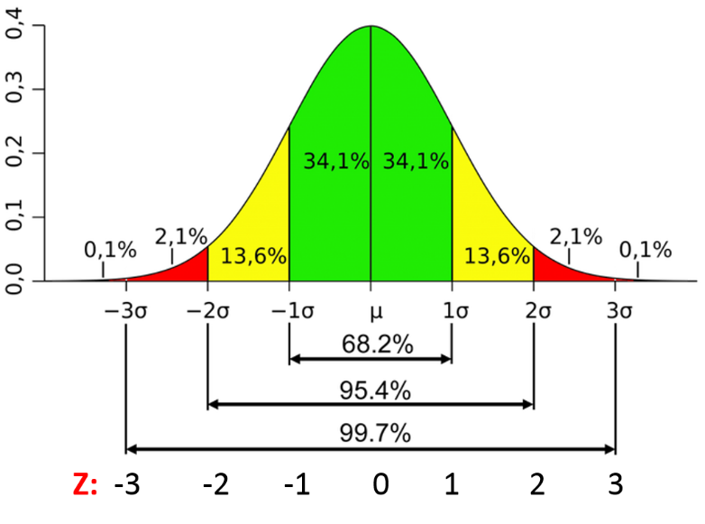
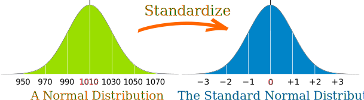

# Distributions - (Gaussian / Normal / Laplace - Gauss)

1. Symmetric about the mean. 
2. Lower variation = Steeper Curve.
3. Formula : 
$$f(x) = \frac{1}{\sigma\sqrt{2\pi}}e^{-\frac{1}{2}(\frac{x-\mu}{\sigma})^2}$$
4. Default assumption of natural data when we have no idea about the data distribution.
5. The area between $\mu \pm nx ; (n \in Natural Number)$ follow a particular breakdown.

## Central Limit Theorem

A sample size increases, the data distribution of the sample usually converges (or becomes similar) to the normal distribution.Therefore, physical quantities that are expected to be the sum of many independent processes, such as measurement errors, often have distributions that are nearly normal.

## Z Score

Given a value ($x$), how many standard deviations away from the mean of the distribution$(\mu)$ it is. 

$$ZScore = \frac{x_i-\mu}{\sigma}$$ 

Example 1:-  
Distribution with : Mean = 4 ; Standard Deviation = 1. Find the Z-Score for 4.75.  
Sol. $$ZScore = \frac{4.75-4}{1} = 0.75 \sigma$$

**Note:** The value (4.75) is on the right of the mean, since the Z-Score is positive. If the Z-Score was negative, the value would be on the left side of the mean.

Example 2:-  
Distribution with : Mean = 4 ; Standard Deviation = 1. Find the Z-Score for 3.75.  
Sol. $$ZScore = \frac{3.75-4}{1} = -0.25 \sigma$$

## Standard Normal Distribution

Normal Distribution where mean $(\mu) = 0$ and standard deviation $(\sigma) = 1$.

### Standardinzing a Normal Distribution

Take every value in a distribution and find its Z-Score. This new array of outputs is the standard normal distribution.

### Appications in ML

**Standardization** is used to scale down all features (column wise data) into a smaller range in a propotional manner so that the decisions are not skewed due to numerical scales. For example : If the dataset has income in 1000s range and age in 10s range, the decision making will be affected highly due to income, as compared to age. However, if we standardize both all the features, both will be reduced to a common numerical scale. This will make both income and age to have similar weightage in the decision making process.

## Normalization

Scaling between a given range lower and higher values. Example : (-1 to 1), (0 to 1), etc based on our choice and use case.

$$ NomalizedValue = \frac{x_i-min}{max-min}$$ 

## Example

### Question1

In an ODI series, these are the given data : 

<table>
    <thead>
        <th>Parameter \ Year</th>
        <th>2021</th>
        <th>2020</th>
    </thead>
    <tbody>
        <tr>
            <td>Scores Average</td>
            <td>250</td>
            <td>260</td>
        </tr>
        <tr>
            <td>Standard Deviation</td>
            <td>10</td>
            <td>12</td>
        </tr>
        <tr>
            <td>Player 1 Score</td>
            <td>240</td>
            <td>245</td>
        </tr>
</table>

Comparing both years, which year did Player1 perform better compared to other players?

### Solution1

$ZScore_{2021} = \frac{240-250}{10} = -1$  
$ZScore_{2020} = \frac{245-260}{12} = -1.25$  

As it is visible, Z-Score of 2021 > Z-Score of 2020. So, Player1 was further back from the mean in 2020 compared to 2021. So, even though Player1 scores lesser in 2021, they performed better.

### Question2

Given a distribution with Mean( $\mu$ ) = 4 and Standard Deviation ( $\sigma$ ) = 1, find the percentage of numbers that are > 4.25.

### Solution2

$ZScore_{4.25} = \frac{4.25-4.0}{1} = 0.25$  

Now, we need all values above $4 + .25 * SD = 4 + 0.25 = 4.25$. Therefore, we need area of curve in $4.25 \lt x \lt \infty$. This is equal to 
$$1 - \{ Area(-\infty \lt x \lt 4) + Area(4 \lt x \lt 4.25)\}$$
$$ = 1 - \{ 0.5 + Area(4 \lt x \lt 4.25)\}$$
$$ = 1 - \{ 0.5 + 0.0987\} = 1 - 0.5987 = 0.4013 $$

So, 40.13% of data is above 4.25.