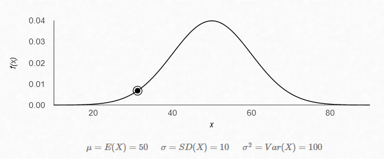
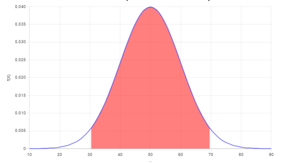

# Hypothesis Testing

## Steps

1. Define Null Hypothesis (the test in the question).
2. Define Alternate Hypothesis (the oppposite of Null Hypothesis).
3. Conduct Experiments.
4. Reject or Accept the Null Hypothesis.

## Example

A fair coin is one which has equal probability of hetting heads and tails. So, for 100 trials, it should ideally have 50 heads and 50 tails as outcome. However, on conducting multiple tests of 100 attempts, we got the following distribution of no. of heads obtained : 

Assumprions : $\sigma=10$ 
The mean$(\mu)$ is 50 because the true ideal coin should have 50 heads out of 100.

### Question
If we toss the coin for 100 times and we get 30 heads (shown in the diagram), is the coin a fair coin or not?

### Solution
We cannot say for sure. We need to define a limit as to how far away from the mean our observation can be in order to qualify as a fair coin. So, we use **Significance Value $(\alpha)$** here.

Let Significance Value $(\alpha)$ = 0.05
So, Confidence Interval = $(100 - \alpha * 100)\% = 95\%$

So, if we take 95% data starting from the mean, it will cover a region like the following :

 

 Here, the red part covers 95% AUC while the white regions cover 2.5% area AUC on both sides. If the value lies inside this region, our Hypothesis passed, else Hypothesis failed.

## Points to Remember

1. Significance Value is defined by a domain expert. So, based on domain expert's input of significance value, we decide if our hypothesis is right or wrong.